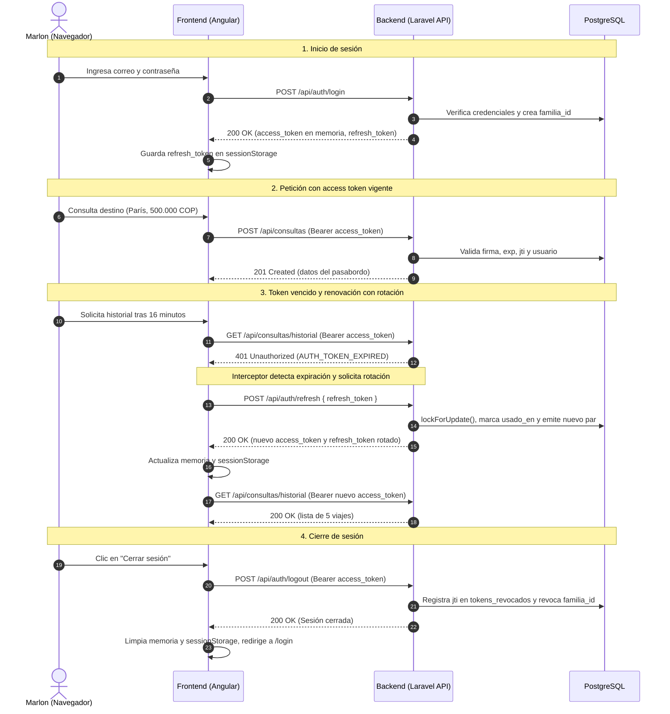

# Pasabordo

[](https://github.com/JoseMedina-prog/prueba-tecnica-infodec/actions/workflows/ci.yml)

Pasabordo es una aplicación web pensada para Marlon, un viajero frecuente que necesita consultar el estado de sus próximos destinos. Marlon elige un país y una ciudad, escribe un presupuesto en pesos colombianos (COP) y obtiene tres datos en una sola pantalla: el clima actual de la ciudad en grados Celsius (°C), cuánto vale su presupuesto en la moneda local del país destino y un historial con sus últimas 5 consultas. Solo entran usuarios registrados y la interfaz está en español y en alemán, facilitando su uso junto a su novia alemana.

El pasabordo es la metáfora visual de la app: el resultado de cada consulta se muestra como un pasabordo físico de vuelo, con tipografías monoespaciadas, códigos IATA y detalles del viaje. La aplicación no maneja vuelos ni reservas aéreas.

---

## Índice

1. [Videos de demostración](#videos-de-demostración)
2. [Capturas de pantalla](#capturas-de-pantalla)
3. [Stack tecnológico y versiones probadas](#stack-tecnológico-y-versiones-probadas)
4. [Requisitos previos y claves de servicios externos](#requisitos-previos-y-claves-de-servicios-externos)
5. [Instalación paso a paso](#instalación-paso-a-paso)
6. [Base de datos](#base-de-datos)
7. [Autenticación y ciclo de vida del token](#autenticación-y-ciclo-de-vida-del-token)
8. [Endpoints de la API](#endpoints-de-la-api)
9. [Manejo de errores](#manejo-de-errores)
10. [Consumo de APIs externas](#consumo-de-apis-externas)
11. [Seguridad y auditoría](#seguridad-y-auditoría)
12. [Pruebas automatizadas](#pruebas-automatizadas)
13. [Inconsistencias del enunciado y soluciones aplicadas](#inconsistencias-del-enunciado-y-soluciones-aplicadas)
14. [Decisiones técnicas y limitaciones conocidas](#decisiones-técnicas-y-limitaciones-conocidas)
15. [Estructura del repositorio](#estructura-del-repositorio)

---

## Videos de demostración

> PENDIENTE: enlace al video 1 (demostración de la aplicación en funcionamiento)

> PENDIENTE: enlace al video 2 (explicación del código y decisiones técnicas)

---

## Capturas de pantalla

Las vistas de la aplicación fueron probadas en escritorio y en celular.

### Inicio de sesión
> PENDIENTE: capturas de pantalla de inicio de sesión en escritorio y celular (diseño actualizado)

### Registro de usuario
> PENDIENTE: capturas de pantalla de registro de usuario en escritorio y celular (diseño actualizado)

### Selección de destino
Pantalla inicial de consulta donde se elige el país y la ciudad destino:
- Escritorio: [docs/capturas/1-destino-computador-es.png](docs/capturas/1-destino-computador-es.png)
- Celular: [docs/capturas/1-destino-celular-es.png](docs/capturas/1-destino-celular-es.png)

### Ingreso de presupuesto
Formulario con validación numérica para el presupuesto en pesos colombianos:
- Escritorio: [docs/capturas/2-presupuesto-computador-es.png](docs/capturas/2-presupuesto-computador-es.png)
- Celular: [docs/capturas/2-presupuesto-celular-es.png](docs/capturas/2-presupuesto-celular-es.png)

### Resultado de la consulta (Pasabordo)
Tarjeta con diseño de pasabordo que presenta clima, conversión y moneda local:
- Escritorio: [docs/capturas/3-resultado-computador-es.png](docs/capturas/3-resultado-computador-es.png)
- Celular: [docs/capturas/3-resultado-celular-es.png](docs/capturas/3-resultado-celular-es.png)

### Mis viajes (Historial)
> PENDIENTE: capturas de pantalla de Mis viajes en escritorio y celular (diseño con talones tipo pasabordo)

### Página no encontrada (404)
Pantalla de error ante rutas inexistentes en el cliente:
- Escritorio: [docs/capturas/5-no-encontrado-computador-es.png](docs/capturas/5-no-encontrado-computador-es.png)
- Celular: [docs/capturas/5-no-encontrado-celular-es.png](docs/capturas/5-no-encontrado-celular-es.png)

---

## Stack tecnológico y versiones probadas

El proyecto consta de un backend en Laravel 11 y un frontend en Angular 20. Las versiones exactas registradas en los archivos composer.lock y package-lock.json son:

- PHP: 8.5.9 en el entorno local. El archivo composer.json fija config.platform.php en 8.2.0 para permitir la instalación desde PHP 8.2 (por eso los paquetes de Symfony quedan en 7.4.19). El CI corre en PHP 8.2 y 8.4. Con PHP 8.5, php artisan test puede mostrar avisos DEPR que vienen de vendor/; la ejecución con vendor/bin/phpunit sale limpia.
- Laravel Framework: 11.56.1.
- PostgreSQL: 16.14 local (imagen postgres:16 en CI).
- Node.js: 24.19.0 local (Node 22 en CI).
- Angular: 20.3.32 (@angular/core).
- Bootstrap: 5.3.8 (personalizado con Sass).
- @ngx-translate/core y @ngx-translate/http-loader: 18.0.0.
- firebase/php-jwt: 7.2.0.
- PHPUnit: 10.5.65.

---

## Requisitos previos y claves de servicios externos

Antes de la instalación, se requiere PHP 8.2+, Composer, Node.js 20+, PostgreSQL 16+ y claves de acceso para dos servicios externos gratuitos:

### Obtención de la clave de OpenWeatherMap
1. Entrar a https://home.openweathermap.org/users/sign_up y registrarse.
2. Confirmar la cuenta mediante el correo recibido.
3. En la sección "API keys", copiar la clave generada por defecto o crear una nueva. La activación de una clave nueva puede tardar entre 10 y 60 minutos en sus servidores.

### Obtención de la clave de ExchangeRate-API
1. Entrar a https://www.exchangerate-api.com/ y registrarse en el plan gratuito ("Free Plan").
2. Confirmar la cuenta con el correo de verificación.
3. Copiar la clave asignada en el panel principal ("Your API Key").

---

## Instalación paso a paso

### 1. Clonar el repositorio
```bash
git clone https://github.com/JoseMedina-prog/prueba-tecnica-infodec.git
cd prueba-tecnica-infodec
```

### 2. Configurar y levantar el backend

Entrar a la carpeta del backend e instalar dependencias:
```bash
cd backend
composer install
```

Copiar el archivo de variables de entorno:

En PowerShell:
```powershell
Copy-Item .env.example .env
```

En Bash:
```bash
cp .env.example .env
```

Generar la clave de la aplicación Laravel:
```bash
php artisan key:generate
```

Generar el secreto para el cifrado y firma de tokens:
```bash
php -r "echo base64_encode(random_bytes(32));"
```
Copiar la cadena generada y pegarla en APP_TOKEN_SECRET dentro de backend/.env. De este secreto base de 32 bytes salen dos claves independientes mediante HKDF (RFC 5869): una para firmar con HS256 y otra para cifrar con AES-256-GCM.

Configurar la base de datos y las claves en backend/.env:
```ini
DB_CONNECTION=pgsql
DB_HOST=127.0.0.1
DB_PORT=5432
DB_DATABASE=travel_app_db
DB_USERNAME=postgres
DB_PASSWORD=tu_contrasena_postgres

FRONTEND_URL=http://localhost:4200

WEATHER_API_KEY=tu_clave_openweathermap
EXCHANGE_API_KEY=tu_clave_exchangerate_api
```
El middleware de CORS lee el origen permitido directamente de FRONTEND_URL.

Crear las bases de datos en PostgreSQL (principal y pruebas):
```bash
createdb -U postgres travel_app_db
createdb -U postgres travel_app_test
```

Ejecutar las migraciones y sembrar los datos:
```bash
php artisan migrate --seed
```

Llenar la caché de clima y tasas de cambio:
```bash
php artisan externos:actualizar
```
Este comando consulta las APIs externas y precarga en la base de datos local 8 climas en español y alemán (16 registros) más 4 tasas de cambio.

Levantar el servidor web del backend:
```bash
php artisan serve
```
El backend responde en http://localhost:8000.

En otra terminal, iniciar el programador de tareas para actualizar datos cada hora:
```bash
php artisan schedule:work
```

### 3. Configurar y levantar el frontend

En una terminal independiente, entrar a la carpeta del frontend e instalar dependencias:
```bash
cd frontend
npm ci
```

Verificar la URL de la API:
La URL del backend está configurada en src/environments/environment.ts y src/environments/environment.development.ts con el valor http://localhost:8000/api.

Iniciar el servidor de desarrollo de Angular:
```bash
npx ng serve
```
O bien:
```bash
npm start
```
El frontend abre en http://localhost:4200.

### Credenciales de prueba
El seeder crea el siguiente usuario listo para iniciar sesión:
- Correo: prueba@travelapp.test
- Contraseña: Prueba123

### Alternativa de carga por script SQL
Para restaurar el esquema completo con datos base sin ejecutar migraciones de Laravel:
```bash
psql -U postgres -d travel_app_db -f docs/database/schema.sql
```

### Problemas comunes
1. Error 500 del servidor de desarrollo: se soluciona ejecutando `php artisan optimize:clear` y reiniciando `php artisan serve`.
2. Correr la colección de Postman con la app abierta en el navegador: cierra la sesión del navegador a propósito, porque la prueba de reuso del refresh token revoca todas las sesiones del usuario activo.

---

## Base de datos

El modelo relacional fue creado en PostgreSQL bajo el estándar de nombres en español solicitado. El diagrama se encuentra en [docs/database/diagrama.png](docs/database/diagrama.png) e incluye la tabla climas.

```
                    ┌──────────────┐
                    │   monedas    │
                    └──────┬───────┘
                           │ 1:N
                           ▼
                    ┌──────────────┐
                    │    paises    │
                    └──────┬───────┘
                           │ 1:N
                           ▼
                    ┌──────────────┐        1:N        ┌──────────────┐
                    │   ciudades   ├──────────────────►│    climas    │
                    └──────┬───────┘                   └──────────────┘
                           │ 1:N
                           ▼
┌──────────────┐    ┌──────────────┐
│   usuarios   ├───►│  consultas   │
└──────┬───────┘1:N └──────────────┘
       │
       ├───────────►┌──────────────────┐
       │ 1:N        │  refresh_tokens  │
       │            └──────────────────┘
       │
       └───────────►┌──────────────────┐
         1:N        │ tokens_revocados │
                    └──────────────────┘

                    ┌──────────────┐
                    │ tasas_cambio │
                    └──────────────┘
```

| Tabla | Propósito |
| :--- | :--- |
| `monedas` | Catálogo de divisas extranjeras (GBP, JPY, INR, DKK) con código ISO, nombre y símbolo. |
| `paises` | Catálogo de países con código ISO alfa-2 (GB, JP, IN, DK) y llave foránea a monedas. |
| `ciudades` | Catálogo de 8 ciudades destino con latitud, longitud, pais_id y codigo_iata (LON, TYO, CPH, etc.). |
| `climas` | Caché de pronósticos obtenidos por ciudad e idioma (es, de), con temperatura, descripcion, icono y obtenido_en. |
| `usuarios` | Cuentas con nombre, correo (único), password_hash (Bcrypt coste 12) e idioma (es o de). |
| `consultas` | Registro histórico de viajes. Guarda una foto del momento (clima, tasa, valor convertido y fechas) para que el historial no cambie después. |
| `tasas_cambio` | Caché de cotizaciones de COP frente a monedas destino con tasa y fecha_tasa. |
| `refresh_tokens` | Tokens de renovación guardados como hash SHA-256 de 64 caracteres hex, con familia_id, expira_en, usado_en y revocado_en. |
| `tokens_revocados` | Lista de identificadores jti de access tokens revocados antes de vencer tras un logout. |

Aclaraciones del diseño:
- Se quitó la tabla users de Laravel porque la prueba prohíbe kits de inicio y pide columnas en español.
- Los seeders usan updateOrCreate y se pueden correr varias veces sin duplicar registros.

---

## Autenticación y ciclo de vida del token

Se utilizó firebase/php-jwt junto con el Encrypter de Laravel. No se usaron Breeze, Jetstream ni Fortify por estar prohibidos en las especificaciones. Se descartaron JWE con web-token/jwt-framework por agregar dependencias innecesarias, y se descartó crear un algoritmo criptográfico propio.

### Estructura y cifrado del token
El token de acceso contiene los siguientes claims:
- sub: id del usuario en la base de datos.
- iat: fecha y hora de emisión.
- exp: expiración a 15 minutos (TOKEN_ACCESS_TTL=15).
- jti: identificador único UUIDv4 para revocación.
- sid: id de sesión (familia_id), que asocia el access token con sus refresh tokens.
- idioma: preferencia del usuario (es o de).
- iss: emisor, validado contra config('app.url').
- aud: audiencia, fijada en 'travel-app'.

El token se firma primero con HS256 y luego se cifra con AES-256-GCM mediante el Encrypter de Laravel. Al validar, el algoritmo está fijo en HS256 (rechaza "none"), el margen leeway es 0 y se revisan iss y aud. Por el cifrado, el token no se puede leer en jwt.io.

### Inicio de sesión (Login)
- Límite de 5 intentos fallidos por minuto por correo e IP (login:{correo}|{ip}). Al sexto intento da 429 TOO_MANY_ATTEMPTS con Retry-After.
- Si el correo no existe se compara igual contra un hash ficticio (self::DUMMY_HASH), para que la respuesta tarde lo mismo y el mensaje sea idéntico (AUTH_INVALID_CREDENTIALS).

### Refresh token y detección de reuso
- Cadena de 32 bytes aleatorios (64 hex), guardada en base de datos como hash SHA-256.
- Duración de 7 días (TOKEN_REFRESH_TTL=7).
- Rotación en cada uso: el token actual se marca con usado_en y se emite un nuevo par bajo la misma familia_id.
- Si se reusa un token ya usado, se revocan todas las sesiones del usuario, porque no se sabe cuál copia es la legítima.
- La operación corre dentro de una transacción con lockForUpdate para que dos renovaciones simultáneas no pasen las dos.

### Cierre de sesión (Logout)
Al llamar a POST /api/auth/logout:
1. Guarda el jti del access token en tokens_revocados hasta su expiración.
2. Marca con revocado_en los refresh tokens de la familia del sid. Las otras sesiones del usuario en otros navegadores siguen activas.

### Orden de revisión del middleware
AuthTokenMiddleware revisa cada petición en este orden:
1. Falta token o cabecera incompleta -> 401 AUTH_TOKEN_MISSING.
2. Formato incorrecto, descifrado fallido o firma alterada -> 401 AUTH_TOKEN_INVALID.
3. Token vencido -> 401 AUTH_TOKEN_EXPIRED.
4. Token revocado por logout en lista negra -> 401 AUTH_TOKEN_REVOKED.
5. Usuario no existe en base de datos -> 401 AUTH_TOKEN_INVALID.

Todas las respuestas 401 llevan la cabecera WWW-Authenticate: Bearer.

### Diagrama de secuencia del flujo de autenticación



### Manejo de tokens en el frontend
- Access token solo en memoria con un signal reactivo en TokenStorageService.
- Refresh token en sessionStorage: tiene menor exposición que localStorage y aguanta un F5. La cookie httpOnly queda como recomendación para producción.
- Al recargar la página, provideAppInitializer toma el refresh token de sessionStorage y pide la renovación para restaurar la sesión.
- El interceptor auth.interceptor.ts comparte una sola renovación en curso (shareReplay(1)) para no disparar la detección de reuso si varias peticiones reciben 401 al mismo tiempo.
- Documentado en detalle en [frontend/TOKEN.md](frontend/TOKEN.md).

---

## Endpoints de la API

Rutas definidas en backend/routes/api.php:

| Método | Ruta | Acceso | Límite | Propósito |
| :--- | :--- | :--- | :--- | :--- |
| `POST` | `/api/auth/register` | Público | 10/min y 30/hora por IP | Registro de usuarios. El límite por IP frena la enumeración de correos. |
| `POST` | `/api/auth/login` | Público | 5 intentos/min por correo+IP | Inicio de sesión. Entrega access y refresh tokens. |
| `POST` | `/api/auth/refresh` | Público | 30/min por IP | Renovación de sesión con rotación de refresh token. |
| `GET` | `/api/auth/me` | Protegido | 60/min por usuario | Retorna los datos del usuario autenticado actual. |
| `POST` | `/api/auth/logout` | Protegido | 60/min por usuario | Cierre de sesión. Revoca el access token actual y los refresh de su familia. |
| `GET` | `/api/salidas` | Público | 30/min por IP | Tablero de salidas del login. Lista las 8 ciudades con IATA y moneda. |
| `GET` | `/api/paises` | Protegido | 60/min por usuario | Lista los 4 países con su moneda. |
| `GET` | `/api/paises/{id}/ciudades` | Protegido | 60/min por usuario | Lista las ciudades del país indicado. |
| `POST` | `/api/consultas` | Protegido | 20/min por usuario | Crea una consulta con clima, conversión y pasabordo. |
| `POST` | `/api/conversion` | Protegido | 20/min por usuario | Alias idéntico de POST /api/consultas (mismo controlador). |
| `GET` | `/api/consultas/historial` | Protegido | 60/min por usuario | Lista las últimas 5 consultas del usuario en sesión. |
| `GET` | `/api/externas/clima/{ciudadId}` | Protegido | 30/min por usuario | Diagnóstico del clima de una ciudad (fuente api/cache/respaldo). |
| `GET` | `/api/externas/tasa/{codigoMoneda}` | Protegido | 30/min por usuario | Diagnóstico de la tasa de cambio frente a COP. |

GET /api/salidas es público porque el login no tiene token y lo que devuelve no es confidencial (destinos disponibles con su moneda). Conserva ese nombre de una versión anterior del login.

---

## Manejo de errores

El backend devuelve los errores en un formato JSON unificado:

```json
{
  "success": false,
  "error": {
    "code": "VALIDATION_ERROR",
    "message": "Error de validación en los datos enviados.",
    "details": [
      {
        "field": "presupuesto_cop",
        "message": "El presupuesto debe ser un número positivo."
      }
    ]
  },
  "trace_id": "a6c8888b-df2f-488f-b98a-aa633959bc8b"
}
```

- Cada respuesta incluye la cabecera X-Trace-Id y el mismo id queda en el log.
- Los mensajes se toman de lang/es/api.php y lang/de/api.php según la cabecera Accept-Language.
- Código 400 para JSON mal formado.
- Códigos 404 y 405 en lugar de excepciones 500.
- Código 413 por encima de 16 KB (16.384 bytes).
- Con APP_DEBUG=false no se filtran trazas de código ni credenciales.

### Códigos de error y estado HTTP

| Código | Estado | Descripción |
| :--- | :---: | :--- |
| `BAD_REQUEST` | 400 | JSON con formato inválido. |
| `AUTH_INVALID_CREDENTIALS` | 401 | Correo o contraseña incorrectos. |
| `AUTH_TOKEN_MISSING` | 401 | No se incluyó el token en la cabecera. |
| `AUTH_TOKEN_INVALID` | 401 | Firma inválida, descifrado fallido o usuario inexistente. |
| `AUTH_TOKEN_EXPIRED` | 401 | Access token superó los 15 minutos. |
| `AUTH_TOKEN_REVOKED` | 401 | Token revocado por logout o reuso de refresh. |
| `NOT_FOUND` | 404 | Recurso o ruta no encontrados. |
| `METHOD_NOT_ALLOWED` | 405 | Método HTTP no permitido. |
| `USER_ALREADY_EXISTS` | 409 | El correo ya está registrado. |
| `PAYLOAD_TOO_LARGE` | 413 | Petición mayor a 16 KB. |
| `VALIDATION_ERROR` | 422 | Fallo en la validación de campos. |
| `TOO_MANY_ATTEMPTS` | 429 | Límite de peticiones excedido (incluye Retry-After). |
| `EXTERNAL_API_ERROR` | 502 | Fallo en respuesta de OpenWeatherMap o ExchangeRate-API. |
| `EXTERNAL_API_TIMEOUT` | 504 | Tiempo de espera agotado al consultar API externa. |
| `INTERNAL_ERROR` | 500 | Error no controlado en el servidor. |

---

## Consumo de APIs externas

Se consumen dos servicios externos:
1. OpenWeatherMap: gratuito, usa clave, units=metric, se consulta por lat/lon para evitar errores con nombres en español o alemán.
2. ExchangeRate-API: gratuito, soporta COP y da la tasa con base en pesos colombianos.

Se descartaron Frankfurter (no tiene COP) y Open Exchange Rates (base solo USD en el plan gratis); Open-Meteo queda como plan B.

### Reglas de servicio y caché
- Cada API está en su propio servicio (ClimaService y MonedaService), con timeout de 5 s, 504 si no responde y 502 si responde mal. Las claves nunca llegan al log.
- Clima: 30 minutos en caché (WEATHER_CACHE_MINUTOS) con respaldo de 24 horas (WEATHER_RESPALDO_HORAS).
- Tasa: en caché si es del día o de menos de 6 horas (EXCHANGE_CACHE_HORAS), con respaldo de la última tasa guardada.
- Fallo de una sola API: la consulta se guarda con un aviso (CLIMA_NO_DISPONIBLE o CONVERSION_NO_DISPONIBLE).
- Fallo de las dos APIs sin respaldo: responde 502 o 504 y no guarda nada en la base de datos.

### Particularidades de los datos
- La tasa del plan gratis es diaria (se actualiza a las 7 p. m. hora de Colombia / 00:00 UTC) y por eso puede diferir unas décimas de Google o Wise.
- La descripción del clima queda en el idioma en que se hizo cada consulta.
- La app muestra la tasa al revés (1 £ = X COP) porque así la piensa una persona, con la directa en pequeño.

---

## Seguridad y auditoría

- Límites por endpoint en AppServiceProvider (login 5/min, registro 10/min y 30/hora, consultas 20/min, externas y salidas 30/min, general 60/min).
- Cabeceras de seguridad en CabecerasSeguridad (nosniff, DENY, no-referrer, CSP, Cache-Control: no-store en auth y remoción de X-Powered-By).
- Log de seguridad en storage/logs/seguridad.log en JSON por línea, con correos enmascarados e IP.
- Comando `php artisan seguridad:resumen --horas=24` para inspección en terminal, sin panel web de administración a propósito para no abrir Broken Access Control.
- Detalle OWASP en [docs/SEGURIDAD.md](docs/SEGURIDAD.md).

### Avisos ignorados en `composer audit`
El archivo composer.json ignora tres avisos que no aplican a la aplicación:
1. PKSA-m5cs-t1y6-qpcs / GHSA-crmm-hgp2-wgrp (laravel/framework): evasión en URLs temporales firmadas. No aplica porque la app no usa URLs firmadas.
2. PKSA-3r5d-mb8f-1qw9 / GHSA-5vg9-5847-vvmq (laravel/framework): inyección CRLF en la regla de correo por defecto al armar correos SMTP. No aplica porque no se envían correos y la regla usa email:rfc,filter con not_regex para bloquear caracteres de escape.
3. PKSA-mdq4-51ck-6kdq / CVE-2026-48019 (laravel/framework): identificador CVE de la misma inyección CRLF en validación de correo.

---

## Pruebas automatizadas

### 1. Pruebas de backend (PHPUnit)
Se ejecutan sobre la base travel_app_test en PostgreSQL (SQLite no se comporta igual con el error 23505, lockForUpdate y tipos uuid).

Comando de ejecución:
```bash
vendor/bin/phpunit
```
Resultado: 46 pruebas y 353 aserciones exitosas, sin fallos. Evidencia en [docs/pruebas/resultado-phpunit.txt](docs/pruebas/resultado-phpunit.txt) y [docs/pruebas/resultado-phpunit.xml](docs/pruebas/resultado-phpunit.xml).

### 2. Pruebas de frontend (Angular / Karma / Jasmine)
Comando de ejecución:
```bash
cd frontend
npx ng test --watch=false --browsers=ChromeHeadless
```
Resultado: 86 pruebas exitosas, sin fallos.

### 3. Pruebas de integración con Newman
Colección y entorno en docs/postman/. Comando exacto utilizado contra el servidor local:
```bash
npx newman run docs/postman/Pasabordo.postman_collection.json -e docs/postman/Pasabordo.local.postman_environment.json --color off
```
Resultado: 32 peticiones y 62 aserciones exitosas, sin fallos. Evidencia en [docs/postman/resultado-newman.txt](docs/postman/resultado-newman.txt).

Aviso: la colección hace 3 registros por corrida, así que más de 3 corridas por minuto dan 429 a propósito por el limitador de tasa.

### Cobertura de las 10 pruebas del enunciado

| # | Prueba del enunciado | Test en el código | Archivo |
| :-: | :--- | :--- | :--- |
| 1 | Token válido es aceptado y devuelve datos del usuario | `test_un_token_valido_es_aceptado_y_devuelve_el_usuario_correcto` | `tests/Feature/Auth/TokenTest.php` |
| 2 | Token con un solo carácter cambiado es rechazado (401) | `test_un_token_con_un_solo_caracter_cambiado_en_el_medio_es_rechazado` | `tests/Feature/Auth/TokenTest.php` |
| 3 | Token creado con otro secreto es rechazado (401) | `test_un_token_creado_con_otro_secreto_es_rechazado` | `tests/Feature/Auth/TokenTest.php` |
| 4 | Token vencido es rechazado (401) | `test_un_token_vencido_es_rechazado` | `tests/Feature/Auth/TokenTest.php` |
| 5 | Token usado después del logout es rechazado (401) | `test_un_token_usado_despues_del_logout_es_rechazado` | `tests/Feature/Auth/LogoutTest.php` |
| 6 | Refresh token usado dos veces revoca todas las sesiones | `test_un_refresh_token_usado_dos_veces_es_revocado_y_cierra_todas_las_sesiones` | `tests/Feature/Auth/RefreshTest.php` |
| 7 | Contraseña incorrecta bloquea al sexto intento con Retry-After | `test_contrasena_incorrecta_bloquea_al_sexto_intento_con_retry_after` | `tests/Feature/Auth/LoginTest.php` |
| 8 | Presupuesto vacío, negativo o con letras devuelve 422 | `test_presupuesto_invalido_devuelve_error_de_validacion` | `tests/Feature/Consultas/ConsultaValidacionTest.php` |
| 9 | Conversión da el valor correcto con tasa simulada | `test_la_conversion_da_el_valor_correcto_con_tasa_simulada` | `tests/Feature/Consultas/ConsultaCreacionTest.php` |
| 10 | Si la API de moneda falla se usa la última tasa de respaldo | `test_si_la_api_de_moneda_falla_se_usa_la_ultima_tasa_guardada_de_respaldo` | `tests/Feature/Consultas/ConsultaCreacionTest.php` |

### Integración Continua (CI)
El archivo [.github/workflows/ci.yml](.github/workflows/ci.yml) ejecuta en cada push o pull request a main:
- backend: corre PostgreSQL 16, PHPUnit y composer audit en PHP 8.2 y 8.4.
- frontend: corre Node 22, npm ci, compilación ng build, pruebas en Chrome Headless y npm audit.

---

## Inconsistencias del enunciado y soluciones aplicadas

| Inconsistencia en el enunciado | Solución aplicada |
| :--- | :--- |
| El Paso 12 dice `POST /api/consultas` y el Anexo A dice `POST /api/conversion`. | Existen las dos rutas en routes/api.php con el mismo controlador. |
| El Paso 4 llama la tabla `historial` y el Paso 12 `consultas`. | Se usó consultas para la tabla y el modelo, con el endpoint /api/consultas/historial. |
| Las tablas `tokens_revocados` y `tasas_cambio` aparecen después del Paso 4. | Se crearon desde el Paso 4 para no volver a tocar migraciones. |
| El diagrama se pide en "PostgreSQL Workbench" (no existe) y luego en "MySQL Workbench". | Se usó la herramienta ERD de pgAdmin sobre PostgreSQL. |
| El refresh token figura como "adicional", pero la prueba 6, el interceptor y /refresh lo necesitan. | Se trató como obligatorio en la arquitectura de autenticación. |
| La prueba 7 exige 429 al sexto intento, pero ningún paso pide el límite. | Se implementó en el login dentro de AuthService. |
| "Si no hay forma de responder, usa 502/504" no dice cuándo. | Con una API caída se responde con aviso; 502/504 solo si fallan las dos sin respaldo. |
| Postman pide una carpeta de "APIs externas (clima y moneda directas)". | Endpoints propios /externas/* más llamadas directas a los proveedores con la clave de cada quien. |

---

## Decisiones técnicas y limitaciones conocidas

### Decisiones técnicas

| Decisión | Por qué | Qué se descartó |
| :--- | :--- | :--- |
| config() en vez de env() | Con config:cache en producción env() devuelve null fuera de config/. | Llamar env() en servicios o controladores. |
| Ordenar los países después de traducirlos | En alemán el orden cambia (Reino Unido vs. Vereinigtes Königreich). | Ordenar solo por base de datos. |
| Código IATA en la base de datos | Los códigos de 3 letras son invariables y no dependen del id del seeder. | Acoplar la interfaz a IDs numéricos fijos. |
| Alemán con "du" | Marlon viaja con su novia y el contexto es personal y cercano. | Alemán formal con "Sie". |
| Fuentes autoalojadas (@fontsource) | Descarga los archivos WOFF2 localmente, evitando llamadas a Google Fonts. | Cargar tipografías por CDN. |
| Bootstrap personalizado por Sass | Permite definir las variables del diseño sin recurrir a !important. | Importar el CSS compilado de Bootstrap. |
| Nombre Pasabordo | "Rinde" significa "corteza" en alemán. Pasabordo refuerza la metáfora de viaje. | Nombres confusos en contexto bilingüe. |
| Sin Docker ni Dependabot | No fueron requeridos en la prueba técnica y añadirían sobrecarga. | Contenedores o bots de dependencias. |
| Límite en registro que cuenta todas las peticiones | El código 409 USER_ALREADY_EXISTS revela si un correo existe; contar todo frena la enumeración. | Limitar solo peticiones 201 exitosas. |

### Limitaciones conocidas
- Laravel 11 ya sin soporte de parches de seguridad (la prueba requería Laravel 10 u 11; para producción se actualizaría a Laravel 12+).
- Refresh token en sessionStorage en vez de cookie httpOnly (se recomienda httpOnly con Secure y SameSite=Strict para producción).
- El servidor corre en HTTP local; en producción requiere HTTPS estricto con HSTS.

---

## Estructura del repositorio

```
prueba-tecnica-infodec/
├── .github/                      # Automatización de integración continua (CI).
│   └── workflows/ci.yml          # Pipeline en GitHub Actions para PHP (8.2, 8.4) y Node 22.
├── backend/                      # API REST en Laravel 11 y PHP 8.2+.
│   ├── app/                      # Controladores, modelos, servicios y middlewares.
│   ├── config/                   # Configuración de token, servicios externos y CORS.
│   ├── database/                 # Migraciones y seeders para PostgreSQL.
│   ├── lang/                     # Mensajes y traducciones en español (es) y alemán (de).
│   ├── routes/                   # Rutas de la API y comandos de consola.
│   └── tests/                    # Pruebas automatizadas en PHPUnit (Feature y Unit).
├── docs/                         # Documentación técnica del proyecto.
│   ├── capturas/                 # Capturas de la interfaz en escritorio y celular.
│   ├── database/                 # Script SQL (schema.sql), especificación DBML y diagrama ERD.
│   ├── postman/                  # Colección y entorno de Postman con reporte de Newman.
│   ├── pruebas/                  # Resultados de ejecución de PHPUnit (txt y xml).
│   └── SEGURIDAD.md              # Documento de arquitectura de seguridad y catálogo OWASP.
├── frontend/                     # Aplicación cliente en Angular 20 y Bootstrap 5.3.
│   ├── src/app/core/             # Servicios centrales, interceptor de tokens y guardias.
│   ├── src/app/features/         # Módulos: auth, consulta, resultado e historial.
│   ├── src/assets/i18n/          # Archivos de traducción en JSON para es y de.
│   ├── src/environments/         # Configuración de URLs de API.
│   └── TOKEN.md                  # Especificación técnica del almacenamiento de tokens.
└── README.md                     # Guía principal de instalación y documentación.
```
