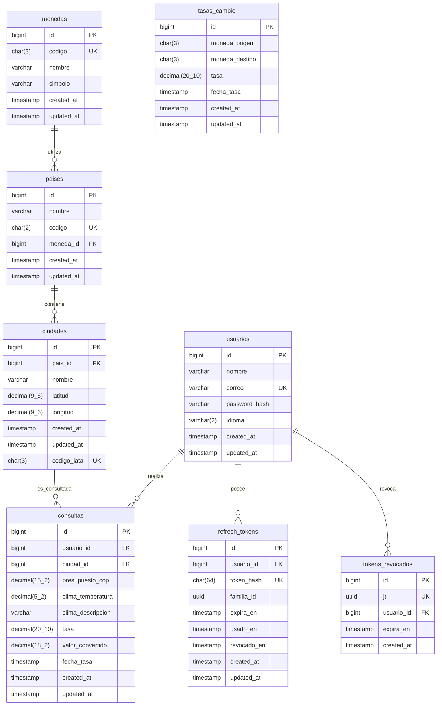

# Documentación de Base de Datos - Travel App

Este directorio contiene la especificación, scripts y esquemas visuales de la base de datos PostgreSQL (`travel_app_db`).

## Archivos del directorio

- `schema.sql`: Script DDL y DML exportado con `pg_dump` con el esquema limpio y los datos iniciales.
- `diagrama.dbml`: Esquema en formato DBML compatible con [dbdiagram.io](https://dbdiagram.io).
- `diagrama.png`: Imagen visual del diagrama de Entidad-Relación exportada desde la herramienta ERD de pgAdmin.

---

## Diagrama Entidad-Relación (Mermaid)

